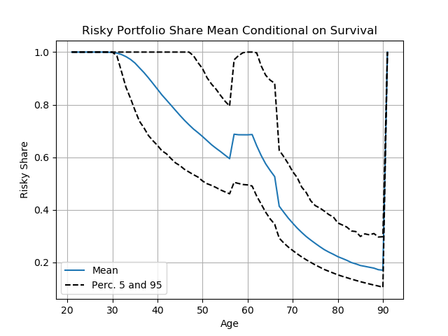
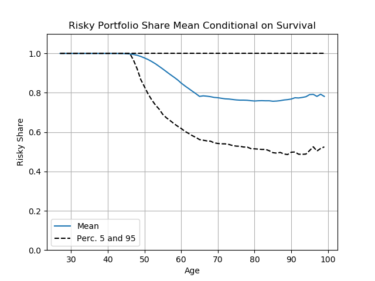

 
# [Blog Post Introducing ConsPortfolioModel to Econ-ARK](https://econ-ark.github.io/REMARK/REMARKs/PortfolioChoiceBlogPost/PortfolioChoiceBlogPost.html)

### Reproduce the results and figures

You can reproduce all of the results of this REMARK on any computer that can run [docker](https://en.wikipedia.org/wiki/Docker_(software)).

To install docker locally follow the [guide](https://github.com/econ-ark/econ-ark-tools/tree/master/Virtual/Docker#install-docker-desktop-macos-and-windows), and launch it so that it is running in the background on your computer.

(Instructions below will work in the terminal on a Mac or Linux machine; Windows users will need to [install bash](https://itsfoss.com/install-bash-on-windows/))
- Then [clone](https://www.toolsqa.com/git/git-clone/) the REMARK repository locally

```
$ git clone https://github.com/econ-ark/REMARK
```
- To make sure figures are reproduced on the correct path, make sure you are in the PortfolioChoiceBlogPost directory
```
$ cd REMARKs/PortfolioChoiceBlogPost
```

As a sanity check, you can confirm the present working directory using

```
$ pwd
```
and it should give you something like
```
/path_to_clone_of_REMARK/REMARKs/PortfolioChoiceBlogPost
```

- Run the following bash script in the directory to reproduce all the figures against different parameters.
```
$ ./do_all_code.sh
```

- This will reproduce the figures in the figures directory.

- If you make any changes to the jupyter notebook you need to rerender the HTML document.
```
jupyter nbconvert --to html PortfolioChoiceBlogPost.ipynb
```


## Other Experiments (Removed to Shorten Blog Post)

### Rising Risk Aversion with Age

Risk aversion is remarkably difficult to measure, and economists' efforts to determine whether it increases with age have been inconclusive.  Some studies have found [evidence for an increase](https://voxeu.org/article/effect-age-willingness-take-risks) (at least during working life) and others have found [little increase](https://onlinelibrary.wiley.com/doi/abs/10.1016/j.rfe.2003.09.010).

For technical reasons, it is difficult for the model to incorporate risk aversion that increases with age.  But your willingness to invest in risky assets depends on both your degree of aversion to risk and your perception of the size of the risk.  So a backdoor way to examine the consequences of rising risk aversion with age is to assume that the _perceived_ riskiness of stock investments goes up with age.  In figures available in the links below, we show that if the perceived riskiness of stock market investment doubles between age 65 and age 100, the model's recommendation looks more like the advice of financial advisors.

This figure suggests that the "100 minus age" rule is not too bad as an approximation of what an extremely risk averse person might want to do -- if they also become more and more fearful of risk after retirement.  

<center><big>
    What If Perceived Risk Increases With Age?
    </big>
<center>
    
</center>


### Greater Income Risk When Young
After the CGM paper was published, better estimates [became available](https://doi.org/10.1016/j.jmoneco.2010.04.003) about the degree and types of income uncertainty that consumers face at different ages.  The most important finding was that the degree of uncertainty in earnings is quite large for people in their 20s but falls sharply then flattens out at older ages.  

It seems plausible that this greater uncertainty in labor earnings could account for the fact that in empirical data young people have a low share of their portfolio invested in risky assets; economic theory says that an increase in labor income risk should [reduce your willingness to expose yourself to financial risk](https://www.jstor.org/stable/2951719).

But the figure below shows that even when we update the model to incorporate the improved estimates of labor income uncertainty, the model still says that young people should have 100 percent of their savings in the risky asset.

<center><big>
    Using Better Data on Income Risk By Age
    </big>
<center>
    
</center>


